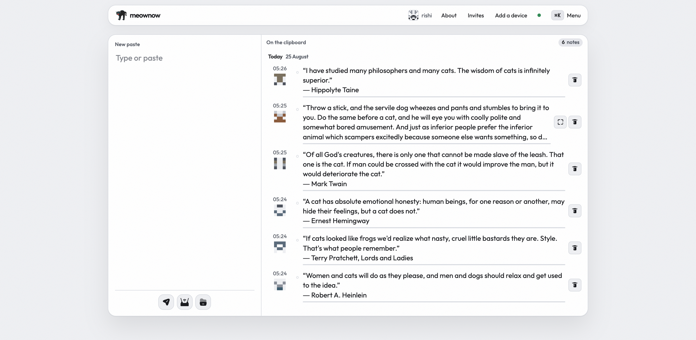
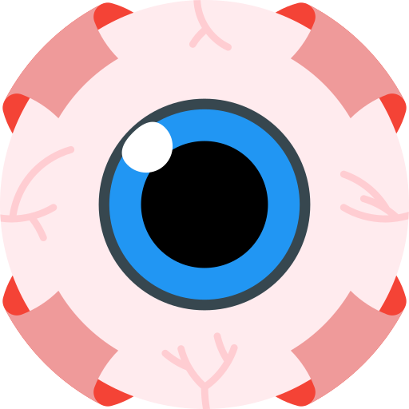

<p align="center">
  
</p>

<h1 align="center">meownow</h1>

<p align="center">
  A private clipboard for people who already know each other.<br />
  Copy here. Paste there. Sealed in the browser before a byte leaves.
</p>

<p align="center">
  
</p>

Invite-only. Passkeys, no passwords. Each account is that person's devices — not a shared tray. You host it.

---

## What you get

| | |
|---|---|
| Text, links, images, files | Notes are markdown in this browser; the store is ciphertext of the source. Type `:smile:` for emoji. Text ≤ 64 KB. A stored file ≤ 100 MB. |
| Sealed on the device | AES-256-GCM in the page. Filename, type, and preview go in the same envelope. |
| The server is a courier | It sees owner, size, time, and kind. Not the text, the name, or the picture. |
| Live only | Skip the store. Needs another device that is live. A refresh drops it. |
| Sync | On (default) writes text and links when a network exists, and queues them here when it does not. Off holds them on this browser until you tap Sync. Files never wait. |
| Offline | After this browser has the clipboard and has loaded once online: open and write text and links. Files need a network. |
| Install | Optional. Puts the app on the home screen. Android can share text and links into it. iOS cannot — paste here. |

There is no public signup and no password fallback. A browser cannot watch the clipboard in the background.

<p align="center">
  
</p>

## What you run

| Piece | Code | Job |
|---|---|---|
| Next.js app | `apps/web` | Identity, invites, metadata. Never file bytes. |
| Cloudflare Worker | `apps/edge` | `/ws` hub, `/upload`, `/dl`, nightly prune. |
| Neon Postgres | `packages/db` | Users, invites, text/link ciphertext. |
| R2 bucket | `meownow-blobs` | File ciphertext. Private. No public access. |

Local `pnpm dev` starts the Next app on `:3000` and the Worker on `:8787`.

---

## You need

- Node 22 or newer
- [pnpm](https://pnpm.io) 11 (`packageManager` is `pnpm@11.22.0`)
- A [Neon](https://neon.tech) project (Postgres)
- A [Cloudflare](https://developers.cloudflare.com/workers/) account with Workers and R2
- A place to host Next.js 15 — [Vercel](https://vercel.com) is what this repo is wired for
- HTTPS for passkeys. `http://localhost:3000` is fine on your machine.

Stay inside free tiers if you can. Invites have no numeric cap; a large group will leave those tiers.

---

## Environment

### Required — Next.js (`apps/web/.env.local` and Vercel)

| Name | What |
|---|---|
| `DATABASE_URL` | Neon pooled URL. `postgres://` or `postgresql://`. |
| `APP_URL` | Public origin of the Next app. Passkeys bind to this hostname. |
| `SESSION_SECRET` | ≥ 32 characters. HMAC for challenge cookies. |
| `ADMIN_ENROLL_SECRET` | ≥ 16 characters. Unlocks `/enroll` once. |

```bash
openssl rand -base64 32   # SESSION_SECRET, HUB_SECRET
openssl rand -base64 16   # ADMIN_ENROLL_SECRET
```

### Required for live send, files, and the hub

Same `HUB_SECRET` on the web app and the Worker.

| Name | Where | What |
|---|---|---|
| `HUB_SECRET` | Web + Worker | ≥ 32 characters. WS tickets and fan-out. |
| `EDGE_URL` | Web | Public Worker origin, e.g. `https://meownow-edge.<account>.workers.dev`. Local: `http://localhost:8787`. |
| `HUB_URL` | Web | Optional. Hub only, if it is not `EDGE_URL`. |
| `CAPABILITY_TOKEN_PRIVATE_KEY` | Web only | Ed25519 JWK JSON, including `d`. |
| `CAPABILITY_TOKEN_PUBLIC_KEY` | Worker only | Same pair, public JWK. No `d`. |
| `APP_URL` | Worker var | Must match the web origin. |
| `APP_ORIGINS` | Worker var | Optional. Extra `/ws` and CORS origins, comma-separated. |

Mint the capability pair (Node 22, no extra packages):

```bash
node --input-type=module -e "
const pair = await crypto.subtle.generateKey({ name: 'Ed25519' }, true, ['sign', 'verify']);
const publicJwk = await crypto.subtle.exportKey('jwk', pair.publicKey);
const privateJwk = await crypto.subtle.exportKey('jwk', pair.privateKey);
console.log('PUBLIC');
console.log(JSON.stringify(publicJwk));
console.log('PRIVATE');
console.log(JSON.stringify(privateJwk));
"
```

Put **PRIVATE** on the web app. Put **PUBLIC** in `apps/edge/.dev.vars` (local) or `wrangler secret put` (production). Never commit `d`. Never put the private JWK on the Worker.

### Optional — web push

```bash
pnpm --filter @meownow/web exec web-push generate-vapid-keys
```

| Name | What |
|---|---|
| `VAPID_PUBLIC_KEY` | From that command. |
| `VAPID_PRIVATE_KEY` | From that command. |
| `VAPID_SUBJECT` | `mailto:` or `https:` URL. |

A notification names the account, not the paste. Skip these and the app still works; devices that are open still see notes.

Local Worker file `apps/edge/.dev.vars`:

```
HUB_SECRET=...
CAPABILITY_TOKEN_PUBLIC_KEY={...public jwk...}
```

---

## Install locally

```bash
git clone https://github.com/CodeDotJS/meownow.git
cd meownow
pnpm install
cp .env.example .env
cp .env.example apps/web/.env.local
cp apps/edge/.dev.vars.example apps/edge/.dev.vars
```

`pnpm db:migrate` and `pnpm db:seed` read the **repo-root** `.env`. Next.js reads **`apps/web/.env.local`**. Put the same values in both, including the secrets above.

Create a Neon database. Set `DATABASE_URL`. Change the admin handle **before** seed if you do not want `rishi`:

```bash
# in .env and apps/web/.env.local
SEED_ADMIN_HANDLE=yourname
SEED_ADMIN_DISPLAY_NAME=Your Name
```

Handle is `[a-z0-9_]`, 2–32 characters. `/enroll` must use that same handle.

```bash
pnpm db:migrate
pnpm db:seed
pnpm dev
```

Open `http://localhost:3000/enroll`. Username = seeded handle. Enroll secret = `ADMIN_ENROLL_SECRET`. Create a passkey. Write down the 12 words when they appear. That screen is once.

After that, `/enroll` is dead. Everyone else needs an invite from **Invites**.

---

## Production

Do this in order. The Worker must know your web origin. The web app must know the Worker origin.

### 1. Neon

Create the project. Run migrate and seed against **production** `DATABASE_URL` from your machine:

```bash
DATABASE_URL='postgresql://…' pnpm db:migrate
DATABASE_URL='postgresql://…' SEED_ADMIN_HANDLE=yourname SEED_ADMIN_DISPLAY_NAME='Your Name' pnpm db:seed
```

### 2. R2

In the Cloudflare dashboard, create a **private** bucket named `meownow-blobs` (or change `bucket_name` in `apps/edge/wrangler.toml`).

Do **not** attach a bucket-wide object expiry. Nightly cron at `03:00 UTC` is the expiry path. A 7-day lifecycle would delete objects the product still needs.

### 3. Worker

```bash
cd apps/edge
npx wrangler deploy --var APP_URL:https://YOUR_WEB_ORIGIN
npx wrangler secret put HUB_SECRET
npx wrangler secret put CAPABILITY_TOKEN_PUBLIC_KEY
```

`package.json` has a deploy script aimed at `https://meownow.vercel.app`. Do not use it unless that is your origin. If you also open the app from localhost against this Worker, set:

```bash
npx wrangler deploy --var APP_URL:https://YOUR_WEB_ORIGIN --var APP_ORIGINS:http://localhost:3000
```

A `GET` on the Worker root returns `meownow-edge`.

### 4. Vercel

Import the repo. Root directory: `apps/web`. `vercel.json` already runs `pnpm install` and `pnpm --filter @meownow/web build` from the monorepo root.

Set the web env vars, including `APP_URL` = the real `https://…` origin, `EDGE_URL` = the Worker origin, and the private capability JWK as one JSON string.

Deploy. Then open `https://YOUR_WEB_ORIGIN/enroll` once.

If you add a custom domain later, change `APP_URL` on both sides and redeploy both. Passkeys issued under the old hostname will not work on the new one.

---

<p align="center">
  
</p>

## After it is up

1. Sign in. Open **Invites**. Send a `/join?t=` link. An unused invite is the only way in. **Ask** on the home page only leaves an email.
2. Text and links do not need file permission. Images and files do. A member requests space from the menu; an admin grants 25–100 MB on **Requests**.
3. Pair a second browser from **Add a device** / **Show a code**. Both sides check a six-digit fingerprint. The 12 words are only if every device is gone (`/recover`).
4. Sync lives on **Account**. It is per browser.

| Kind | Where | How long |
|---|---|---|
| Text, link | Neon | 30 days |
| Image, file | R2 | 7 days |
| Live only | Nowhere | Until refresh |

---

## Do not

- Log tokens, recovery phrases, or plaintext.
- Put `CAPABILITY_TOKEN_PRIVATE_KEY` on the Worker.
- Set an R2 lifecycle that deletes the whole bucket after 7 days.
- Point a production Neon `DATABASE_URL` at a localhost Worker (or the reverse) unless you mean two different hubs.
- Expect iOS to appear in the share sheet. Paste in the installed app.

Day-to-day ops (revoke a device, rotate the capability pair, restore Neon): [`docs/RUNBOOK.md`](docs/RUNBOOK.md).

The spec is [`docs/SPEC.md`](docs/SPEC.md).

---

<br>

<div align="center">

<p align="center">
  
</p>


__License__

<br>

Copyright © 2026 [Rishi Giri](https://rishi.rest)

<br>

meownow is released under the [MIT License](LICENSE)

</div>